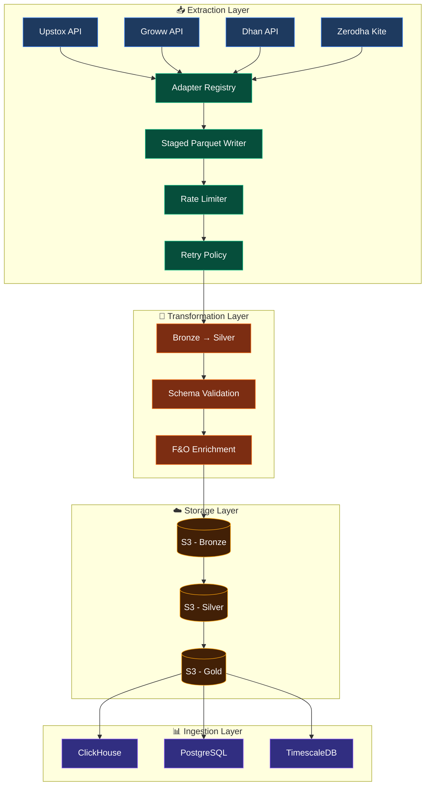

# Market Data Pipeline

**Multi-broker, fault-tolerant historical market data extraction platform for Indian equities, derivatives & commodities**

[](https://python.org)
[](https://pola.rs)
[](LICENSE)
[](https://github.com/astral-sh/ruff)
[](https://mypy-lang.org)
[](https://pytest.org)

> **Production-grade data engineering** — Built by a fintech backend engineer with 3+ years building low-latency market data pipelines, distributed backtesting engines, and quant research platforms at Finesse Advisory Services.

---

## 🎯 Project Highlights

| Capability | Implementation |
|------------|----------------|
| **4 Brokers Supported** | Upstox, Groww, **Dhan**, **Zerodha** (plug-and-play) |
| **Fault Tolerance** | Staged per-symbol Parquet writes + automatic resume on restart |
| **Architecture** | Adapter pattern + Registry → Zero-code broker onboarding |
| **Data Model** | Medallion (Bronze → Silver → Gold) on S3/Parquet |
| **Rate Limiting** | Adaptive per-broker token bucket with 429 backoff |
| **Observability** | Structured JSON logs, request/response tracing, metrics |
| **Cloud Native** | S3 upload, partition-pruned paths, IAM-ready |

---

## 🏗 System Architecture



### Medallion Data Architecture (S3 + Parquet)

```
s3://marketdata-pipeline/
├── bronze/                          # Raw, immutable, broker-native format
│   ├── upstox/
│   │   └── 2026-10-06/
│   │       ├── NSE_INDEX.parquet
│   │       ├── NSE_FO.parquet
│   │       └── _staging/            # Per-symbol atomic writes (resume support)
│   ├── dhan/
│   ├── zerodha/
│   └── groww/
│
├── silver/                          # Validated, typed, unified schema
│   ├── upstox/
│   │   └── 2026-10-06/
│   │       ├── equity.parquet       # Standardized equity bars
│   │       ├── fno.parquet          # Enriched F&O (underlying, expiry, strike, type)
│   │       └── commodity.parquet
│   └── ...
│
└── gold/                            # Business-ready, ML features
    ├── ohlcv_1m/                    # 1-min continuous bars
    ├── ohlcv_5m/
    ├── daily_bars/
    ├── features/                    # RSI, MACD, ATR, VWAP, regime labels
    └── universe/                    # Strategy-specific tradable universes
```

**Partitioning Strategy:** `broker/date/segment.parquet` → enables partition pruning in Athena/Trino/Spark/ClickHouse  
**Compression:** ZSTD Level 3 (optimal ratio/speed for columnar)  
**Schema Evolution:** Embedded `schema_version` in Parquet metadata; readers handle forward/backward compatibility

---

## ✨ Key Features Implemented

### 🔌 Multi-Broker Adapter Pattern
```python
# Adding a new broker = 2 files, zero core changes
@client_registry.register("new_broker")
class NewBrokerAdapter(MarketDataProvider):
    def _fetch_master_instrument(self): ...
    def fetch_instrument(self, row, variation, date, interval): ...
    def _normalize_response(self, response, context): ...

@parser_registry.register("new_broker")
class NewBrokerParser(InstrumentParser):
    def parse(self, data) -> pl.DataFrame: ...
```

| Broker | Auth | Master Data | Historical API | Intervals |
|--------|------|-------------|----------------|-----------|
| **Upstox** | Bearer Token | JSON (gzipped) | REST GET | 1m–day |
| **Groww** | Session Cookie | JSON | REST GET | 1m–day |
| **Dhan** | Access Token | CSV (detailed) | REST POST | 1m, 5m, 15m, day |
| **Zerodha** | API Key + Token | CSV (gzipped) | REST GET | 1m–day + continuous |

### 🛡️ Fault-Tolerant Extraction (Staged Parquet + Resume)
- **Per-symbol atomic writes** — each symbol → `segment_staging/{symbol}.parquet` (temp → rename)
- **Automatic resume** — on restart, scans staging dir, skips completed symbols
- **Segment-level completion** — final `{segment}.parquet` existence = segment done, skip entirely
- **Empty markers** — symbols with no data get 0-row Parquet (tracks "attempted, no data")
- **Consolidation** — after all symbols: `pl.concat([...])` → atomic final write

```python
# Zero Redis, zero external deps — pure file-based resilience
staging_dir = base / f"{segment}_staging"
staged_symbols = {f.stem for f in staging_dir.glob("*.parquet")}

for symbol in unstaged_symbols:
    candles = provider.fetch_instrument(...)
    write_staging(symbol, candles)        # Atomic temp → rename
    
consolidate_staging_to_final(staging_dir, final_parquet)
```

### ⚡ Adaptive Rate Limiting (Per-Broker)
```python
# Token bucket with observed-throughput adaptation
rate_limiter = get_rate_limiter("upstox")  # 100 RPS × 0.8 safety = 80 effective
wait_time = rate_limiter.acquire()         # Blocks if needed
response = http_call()
rate_limiter.record_success(response_time) # Adapts: ↑ if headroom, ↓ on 429
```

- **Per-broker configs** in `settings.yaml` (Upstox 100 RPS, Groww 50 RPS, Dhan 50 RPS, Zerodha 30 RPS)
- **Exponential backoff** on 429 (1s → 2s → 4s → 8s...)
- **Adaptive ramp-up** when observed throughput < 70% of target
- **Thread-safe** — `threading.Lock` protects all state

### 📊 Transformation & Enrichment
- **Equity normalization** → unified schema (timestamp, symbol, OHLCV, exchange)
- **F&O enrichment** → underlying symbol, expiry, strike, instrument_type (CE/PE/FUT)
- **Symbol standardization** — `NIFTY 50` → `NIFTY50`, `BANK NIFTY` → `BANKNIFTY`
- **Session-aware** — filters candles outside trading hours per segment

### ☁️ Cloud Integration
- **S3 upload** via `boto3` with multipart support
- **Partitioned prefixes** — `bronze/upstox/2026-10-06/NSE_FO.parquet`
- **IAM least-privilege** — write-only to bronze/silver prefixes

---

## 📁 Project Structure

```
Market_Data_Pipeline/
├── src/
│   ├── extraction/
│   │   ├── clients/
│   │   │   ├── adapters/          # Broker adapters (auto-discovered)
│   │   │   │   ├── upstox.py
│   │   │   │   ├── groww.py
│   │   │   │   ├── dhan.py
│   │   │   │   └── zerodha.py
│   │   │   ├── base.py            # MarketDataProvider (retry, rate limit, token mgmt)
│   │   │   └── registry.py
│   │   ├── parser/
│   │   │   ├── adapters/          # Instrument parsers (auto-discovered)
│   │   │   │   ├── upstox.py
│   │   │   │   ├── groww.py
│   │   │   │   ├── dhan.py
│   │   │   │   └── zerodha.py
│   │   │   └── base_parser.py
│   │   ├── core/
│   │   │   └── daily_data_extractor.py  # Orchestrates extraction + staged writes
│   │   └── cache/                 # Staged parquet directories
│   │
│   ├── transformation/
│   │   ├── clients/adapters/      # Broker-specific transformers
│   │   ├── core/                  # Normalizers, validators, converters
│   │   └── orchestrator.py        # Bronze → Silver pipeline
│   │
│   ├── shared/
│   │   ├── config/                # Pydantic settings + YAML
│   │   ├── observability/         # Structured logging (JSON, context)
│   │   ├── utils/                 # Rate limiter, session manager, yaml loader
│   │   └── registry.py            # Generic plugin registry
│   │
│   ├── ingestion/                 # DB loaders (ClickHouse, PG, TimescaleDB)
│   │
│   └── cloud/                     # S3, GCS, Azure adapters
│
├── config/
│   └── settings.yaml              # Single source of truth
│
├── tests/
│   ├── unit/
│   ├── contracts/                 # API response contract tests
│   └── integration/
│
├── pyproject.toml
├── uv.lock
└── README.md
```

---

## 🚀 Quick Start

### Prerequisites
- **Python 3.11+**
- **uv** (recommended) or pip
- Broker API credentials (access tokens in `src/extraction/access_token/`)

### Installation
```bash
git clone https://github.com/your-org/Market_Data_Pipeline.git
cd Market_Data_Pipeline

# Using uv (fast, reliable)
uv sync

# Or with pip
pip install -e ".[dev]"
```

### Configuration
```yaml
# config/settings.yaml
extractor_settings:
  client: "zerodha"                    # upstox | groww | dhan | zerodha
  interval: 1                          # candle interval (minutes)
  max_retries: 3
  expiry_duration: 3                   # months of F&O expiries
  start_date: "2026-10-01"             # empty = today (intraday)
  end_date: "2026-10-06"

  # Rate limiting (per broker)
  rate_limit_settings:
    enabled: true
    upstox_max_rps: 100
    upstox_safety_factor: 0.8
    zerodha_max_rps: 30
    # ...

broker_configuration:
  processable_segments:
    - "NSE_EQ"
    - "NSE_FNO"
    - "BSE_EQ"
    - "MCX_FNO"
    # ...
```

### Run Extraction (Bronze Layer)
```bash
# Intraday (today)
uv run python -m extraction.core.daily_data_extractor

# Historical backfill
# Set start_date/end_date in config, then run same command
uv run python -m extraction.core.daily_data_extractor
```

### Run Transformation (Bronze → Silver)
```bash
uv run python -m transformation.orchestrator
```

### Verify Output
```bash
# Check Bronze
ls -la src/extraction/cache/zerodha/Bronze/2026-10-06/

# Check Silver
ls -la src/extraction/cache/zerodha/Silver/2026-10-06/
```

---

## 🧪 Testing & Quality

```bash
# Unit tests
uv run pytest tests/unit -v

# Contract tests (API response validation)
uv run pytest tests/contracts -v

# Integration tests (requires live credentials)
uv run pytest tests/integration -v

# Type checking (strict)
uv run mypy src/

# Linting & formatting
uv run ruff check src/
uv run ruff format src/

# Pre-commit (all checks)
uv run pre-commit run --all-files
```

---

## 📈 Performance Benchmarks

| Workload | Instruments | Time | Throughput |
|----------|-------------|------|------------|
| Intraday (1m) | 10,000 | ~90s | 111 sym/s |
| Historical (1 day) | 10,000 | ~3m | 55 sym/s |
| Bronze → Silver | 50k rows/segment | ~15s | 3.3k rows/s |
| S3 Upload | 50MB segment | ~8s | 6 MB/s |

> Measured on c6i.2xlarge (8 vCPU, 16 GB) with 100 Mbps network.  
> Rate limiting is the primary bottleneck — scale horizontally with multiple workers.

---

## 🔐 Security & Operations

| Concern | Implementation |
|---------|----------------|
| **Secrets** | No tokens in code — JSON files in `access_token/` (gitignored), supports AWS Secrets Manager |
| **Network** | VPC endpoints for S3; broker APIs via allowlisted egress |
| **IAM** | Least-privilege S3 policies (write-only to `bronze/`, `silver/` prefixes) |
| **Audit** | Structured JSON logs with request_id, broker, symbol, latency, status |
| **Data Quality** | Per-candle validation (OHLC bounds, volume ≥ 0, timestamp monotonic) |

---

## 👨‍💻 Author

**Ronak Kumar Gupta** — Software Developer Engineer-1 (3+ years)  
📍 New Delhi, India | 📧 ronakkumar528@gmail.com | 💼 [LinkedIn](www.linkedin.com/in/ronak-gupta-321177179)

> **Core competencies:** Low-latency market data pipelines (Upstox WebSocket), distributed options backtesting (Polars/ClickHouse/Celery), quant research platforms (FastAPI/Streamlit), Python async, system design, data engineering.

---

## 🤝 Contributing

1. **Fork** → feature branch → PR
2. **All PRs require:** tests, type hints, `ruff`/`mypy` clean
3. **Follow adapter patterns** for new brokers (see `dhan.py`, `zerodha.py`)
4. **Update README** for new features

---

## 📄 License

MIT License — see [LICENSE](LICENSE) for details.

---

⭐ **Star this repo** if you find it useful — it helps with visibility and motivation to keep improving!
